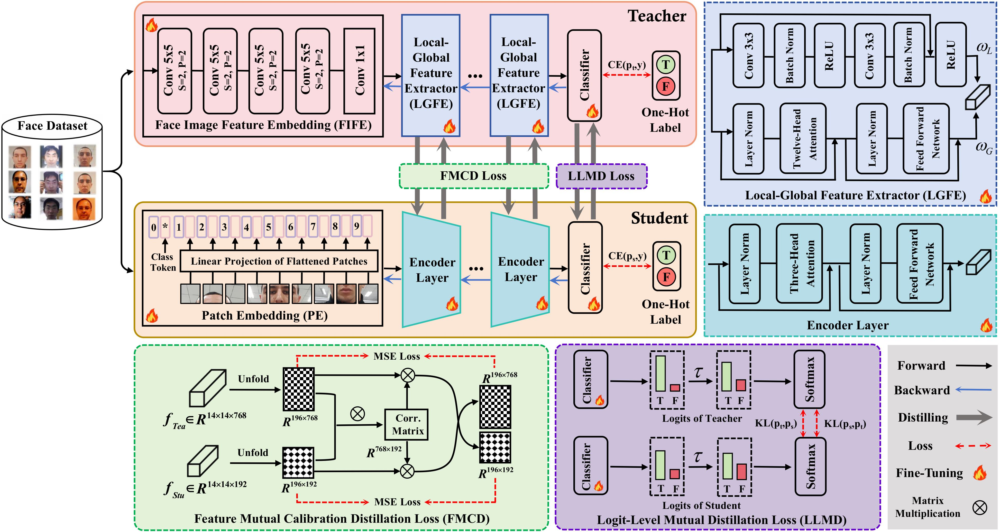

# HFMC-FAS

Official repository for the article "Heterogeneous Feature Mutual-Calibration Assisted Online Distillation for Efficient Face Anti-Spoofing", which has been accepted at ICASSP 2026 and can be found [here](https://ieeexplore.ieee.org/document/11463904).

---

## 🔔Introduction
With the widespread use of face recognition, Face Anti-Spoofing (FAS) has gained increasing importance. While Convolutional Neural Network (CNN)-based methods exhibit limitations in modeling long-range dependency, Vision Transformer (ViT)-based approaches are often too computationally expensive for deployment. Thus, we propose HFMC-FAS, an efficient online distillation framework with Heterogeneous Feature Mutual-Calibration for FAS. Its main contributions are threefold: (1) An online distillation framework to reduce FAS model parameters via collaborative parameter updating between teacher and student. (2) A cascaded local-global feature extractor designed for the teacher, aiming to capture facial texture details and structural features. (3) A feature mutual-calibration strategy to address heterogeneous feature mismatching in middle layers between teacher and student. Experiments on three FAS datasets demonstrate that our distilled the 5MB student achieves competitive or superior performance compared to related state-of-the-art (SOTA) methods. HFMC-FAS enables practical deployment of robust FAS in real-world scenarios with minimal computational overhead.

<div align="center">
    
</div>

## ✏️ Citation
If you find this work useful for your research, please feel free to leave a star⭐️ and cite our paper:

```bibtex
@INPROCEEDINGS{11463904,
  author={Zhang, Jun and Shen, Jia and Wang, Hui and Liu, Jiahua and Gao, Yixing and Feng, Shu and Li, Dongxi and Zhou, Daoxiang},
  booktitle={ICASSP 2026 - 2026 IEEE International Conference on Acoustics, Speech and Signal Processing (ICASSP)}, 
  title={Heterogeneous Feature Mutual-Calibration Assisted Online Distillation for Efficient Face Anti-Spoofing}, 
  year={2026},
  volume={},
  number={},
  pages={14317-14321},
  doi={10.1109/ICASSP55912.2026.11463904}}
```
